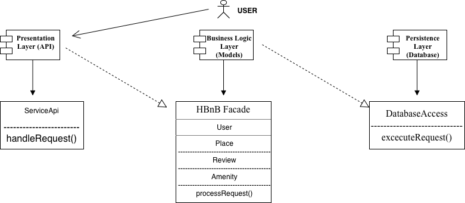

# HBnB Evolution - Technical Documentation

## Task 1: High-Level Package Diagram

### Layer Responsibilities

* **Presentation Layer (API):**
    * **Component:** `ServiceApi`
    * **Function:** Receives user requests and executes `handleRequest()`. It serves as the interface between the client and the application logic.

* **Business Logic Layer (Models):**
    * **Component:** `HBnB Facade`
    * **Function:** Orchestrates the system logic via `processRequest()`. It manages the core entities: **User**, **Place**, **Review**, and **Amenity**.

* **Persistence Layer (Database):**
    * **Component:** `DatabaseAccess`
    * **Function:** Handles data storage and retrieval. It executes `excecuteRequest()` to interact with the database engine while abstracting storage details from other layers.

---

### Facade Pattern Explanation

The **HBnB Facade** is positioned in the Business Logic Layer to act as a single entry point for the Presentation Layer.

* **Purpose:** It simplifies the interaction between layers by providing a unified interface.
* **Benefit:** It decouples the API from the internal models. Changes to individual models do not require changes to the API controllers.
* **Process:** The API calls the Facade, which then coordinates the necessary actions across the various domain models.
