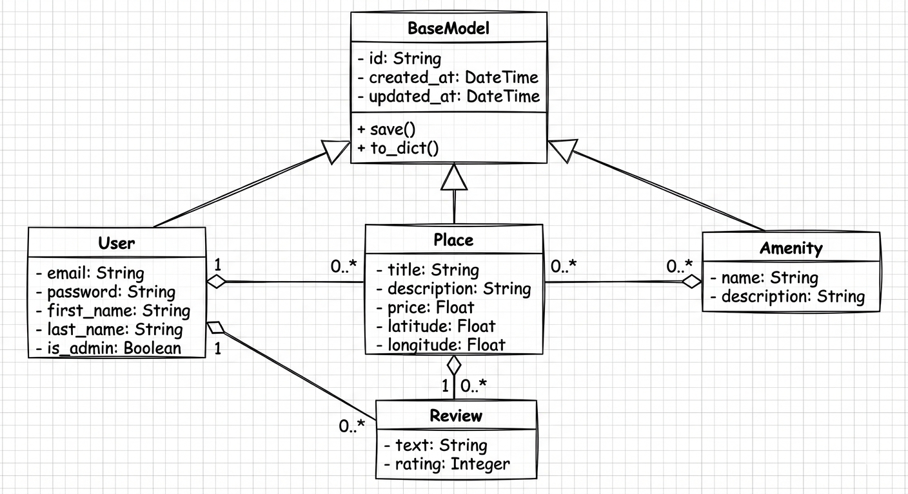
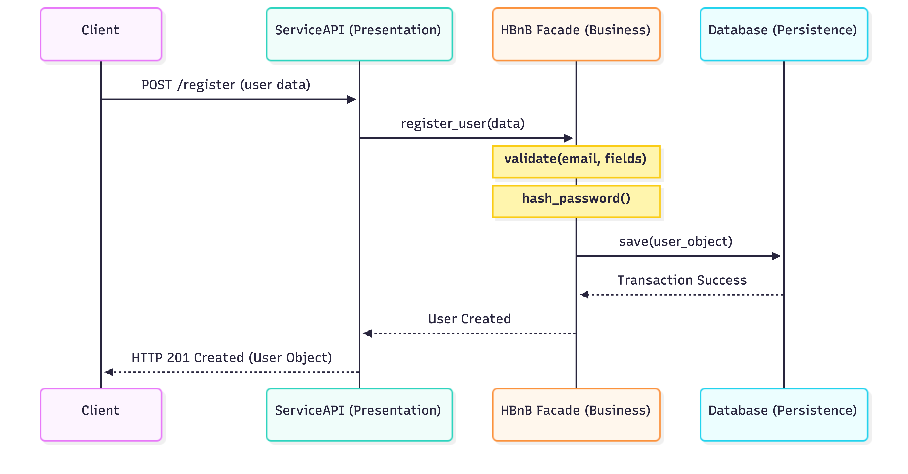
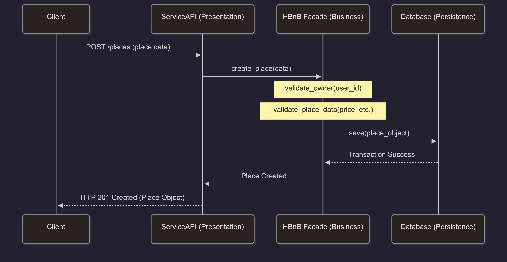
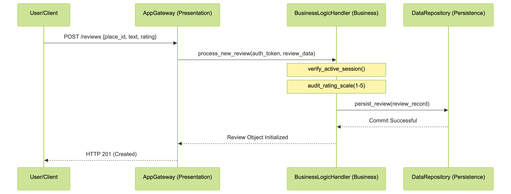
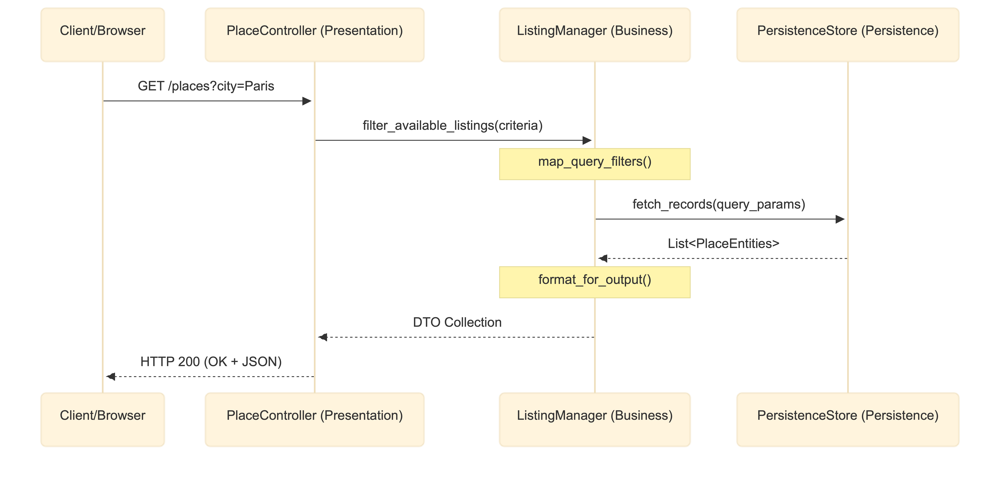

# HBnB Evolution: Complete Technical Documentation

## 1. Introduction
This document serves as the comprehensive architectural blueprint for the **HBnB application**. Its purpose is to detail the system's design across three levels of abstraction: high-level package organization, detailed object-oriented business logic, and real-time API interaction flows. This guide ensures a consistent implementation process, adhering to modularity and separation of concerns.

---

## 2. High-Level Architecture
The HBnB application follows a **Three-Layer Architecture** supported by the **Facade Pattern**. This ensures a clear separation of concerns, where each layer only communicates with the one directly below it.

### Layer Responsibilities
* **Presentation Layer (API):** Managed by the `ServiceApi` component. It receives user requests and executes `handleRequest()`, serving as the interface between the client and the application logic.
* **Business Logic Layer (Models):** Orchestrated by the `HBnB Facade`. It manages core entities (**User, Place, Review, Amenity**) and handles the system logic via `processRequest()`.
* **Persistence Layer (Database):** Controlled by `DatabaseAccess`. It executes `executeRequest()` to interact with the database engine while abstracting storage details from the higher layers.

### Facade Pattern Rationale
The **HBnB Facade** acts as a single entry point for the Presentation Layer. This decouples the API from the internal models, ensuring that changes to individual business rules do not break the API controllers.

---

## 3. Business Logic Layer
This section details the internal structure of the Business Logic layer, focusing on core entities and their object-oriented relationships.

### Entity Descriptions
* **BaseModel**: The parent class for all entities. It provides a unique identifier (**UUID4**) and audit timestamps (`created_at`, `updated_at`) for every object.
* **User**: Represents individuals (Owners/Guests) with attributes like `email`, `password`, and `is_admin`.
* **Place**: Represents rental properties, storing data such as `title`, `price`, and coordinates.
* **Review**: Feedback left by users for places, including a `text` field and a `1-5 rating`.
* **Amenity**: Features like WiFi or AC, linked to places.

### Relationships and Multiplicity
* **Inheritance**: All core entities (User, Place, Review, Amenity) inherit from **BaseModel**.
* **User to Place (1:N)**: An owner can list multiple places.
* **Place to Review (1:N)**: A place can receive multiple pieces of feedback.
* **Place to Amenity (N:N)**: Places can have many amenities, and amenities can apply to many places.

---

## 4. API Interaction Flow
These sequence diagrams illustrate the communication between the layers for critical system operations.

### I. User Registration
**Purpose**: To securely register a new user. The `HBnB_Facade` validates input and hashes passwords before the `Database` commits the record.

### II. Place Creation
**Purpose**: To allow authorized users to list properties. The Logic layer verifies owner existence and data integrity before storage.

### III. Review Submission
**Purpose**: To record feedback. The `BusinessLogicHandler` checks rating scales and ensures the user is authorized before saving to the `DataRepository`.

### IV. Fetching a List of Places
**Purpose**: To retrieve properties based on filters. The `ListingManager` processes criteria and queries the `PersistenceStore` to return data.

---

## 5. Design Decisions & Compilation Summary
* **UUID4 Identification**: All entities use UUID4 to prevent ID collisions and ensure security by making IDs non-enumerable.
* **Architecture Strategy**: The three-layer approach allows the database or UI to be swapped without rewriting the core business rules.
* **Validation Centralization**: All business rules are enforced in the Logic layer (Facade) to prevent corrupt data from reaching the Persistence store.
